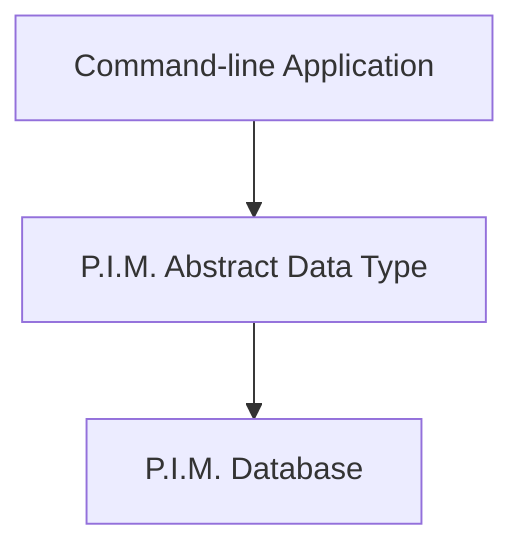

# Acme PIM v0.1 🚀 

Showcasing a variety of OOP-wise design patterns, this repository is an academic exercise demonstrating a simple implementation of a product information management system (PIM).
It presents the C++ 17 code files for a command-line application that manages a database of products and categories. 

## Core functionalities:
- **A modular library for terminal-based user interfaces**
- **Database in SQLite**
- **An Abstract Data Type (ADT) class for**
  - *Product Management and Persistence*
    - Create, update, delete, and query products with attributes like name, SKU, description, price, and category.
  - *Category Management and Persistence*
    - Add, modify, delete, and visualize categories.
  - **Custom Attributes and Variants**
    - Flexible definition of product attributes (e.g., color, size) and management of product variants.

## Layer overview

### Overview:
## Architecture Overview of Acme PIM 🚀


## Main dependencies:
  - C++ 17
  - CMake v3.29
  - Sqlite3 v3.47.0

## Installation:
1. Clone the repository:
```bash
git clone https://github.com/jauascat/acme-pim.git
```
2. Two options for compilation base on operating system:
  1. Windows:
    - Compile using JetBrains' CLion. 
    - Clion's project files are included in the repository.
    - Sqlite3 is included in the repository, so no need to install it.
    
  2. Linux based:
    - Use Microsoft's Visual Studio Code
    - Be sure to have environment properly installed on your machine:
      - C++ 17 enabled compiler
      - Sqlite3 v3.47.0
      - CMake v3.29
    - Compile using CMake and execute using `launch.json` file.
3. Executable is placed in `./build/acme_pim`
